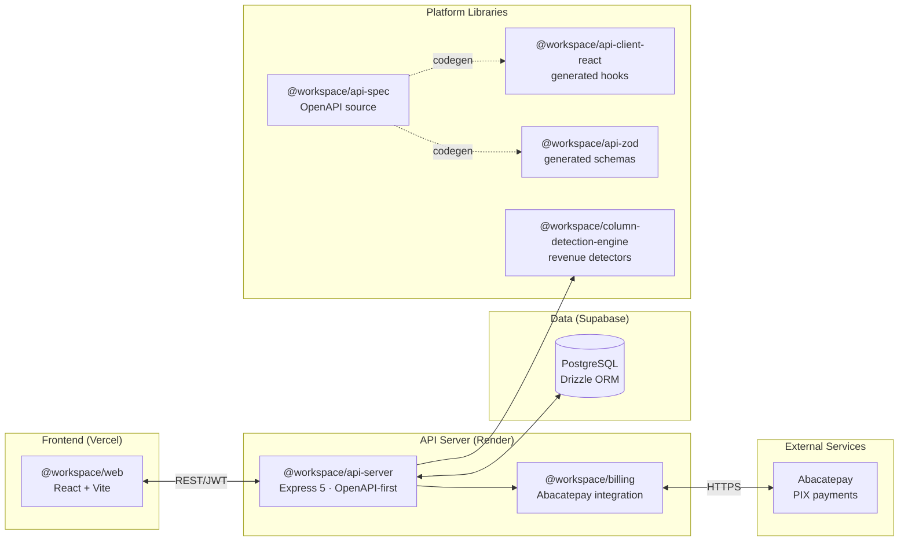

<div align="center">

# ARQON Platform

### Revenue Engine SaaS — Surface hidden revenue leaks from your data

[](https://opensource.org/licenses/MIT)
[](https://nodejs.org/)
[](https://www.typescriptlang.org/)
[](https://pnpm.io/)
[](#)

**Governance-first · Spec-driven · Monorepo**

</div>

---

## Overview

ARQON is a full-stack SaaS platform that helps companies identify hidden
revenue leaks by analyzing CSV data exports — invoices, CRM pipeline,
contracts — and surfacing actionable findings with prioritized
recommendations.

The platform is engineered with a **governance-first, specification-driven**
methodology: every component is governed by a frozen technical standard
before a line of implementation is written. This repository contains both
the application and the full engineering governance corpus that governs it.

---

## Architecture



### Repository layout

| Directory | Purpose | Stability |
|---|---|---|
| `artifacts/` | Applications (api-server, web, mockup-sandbox) | Stable |
| `lib/` | Grandfathered platform libraries (api-spec, api-client, db, engine) | Stable |
| `packages/` | Going-forward home for new platform libraries (billing) | Growing |
| `docs/governance/` | Engineering standards, specs, briefs | Frozen corpus |
| `scripts/` | Build & tooling scripts | Internal |

### Import contract

Cross-package imports use the `@workspace/*` scoped contract. Relative
cross-package imports are forbidden.

```ts
// ✅ Correct
import { createCharge } from "@workspace/billing";

// ❌ Forbidden
import { createCharge } from "../../packages/billing/src/client";
```

---

## Tech stack

| Layer | Technology |
|---|---|
| **Monorepo** | pnpm workspaces, Node.js 24, TypeScript 5.9 |
| **Frontend** | React 19, Vite, TanStack Query, wouter, shadcn/ui, Tailwind CSS |
| **API** | Express 5, OpenAPI-first contract (Orval codegen), esbuild |
| **Database** | PostgreSQL (Supabase), Drizzle ORM |
| **Validation** | Zod, drizzle-zod |
| **Auth** | JWT (`arqon_token`), Bearer token injection, `@workspace/auth` |
| **Payments** | Abacatepay (PIX), `@workspace/billing` |
| **Deployment** | Render (API) · Vercel (frontend) · Supabase (database) |

---

## Governance corpus

The platform is governed by a frozen engineering documentation system.
Every standard is versioned, status-tracked, and lives in version control.

### Technical standards (frozen)

| ID | Standard | Scope |
|---|---|---|
| EDS-001 | Engineering Documentation Standard | Document structure & metadata |
| EES-001 | Engineering Execution Standard | ADRs, freeze protocol, lifecycle |
| ESS-001 | Engineering Specification Standard | Spec structure & validation |
| TS-001 | Technical Standard Meta-Specification | How standards are authored |
| API-001 | Public API Specification Standard | Public interface contracts |
| RT-001 | Runtime Specification Standard | Runtime behavior contracts |
| SM-001 | State Machine Specification Standard | State lifecycle contracts |
| ADAPT-001 | Adapter Specification Standard | Provider integration mapping |
| SEC-001 | Security Specification Standard | Threat models, secrets, webhooks |

### Package specifications

| Package | Specs | Status |
|---|---|---|
| `@workspace/billing` | ARCH, API, RT, SM, SEC, ADAPT, TEST | Frozen v1.0.0 |
| `@workspace/auth` | ARCH, API, RT, SM, SEC, TEST | Frozen v1.0.0 |

### Planning documents

| ID | Package | Status |
|---|---|---|
| SPD-001 | `packages/i18n` | Active |
| SPD-002 | `packages/billing` | Active |
| SPD-003 | `packages/auth` | Active |

Browse the full index at [`docs/governance/INDEX.md`](docs/governance/INDEX.md).

---

## Getting started

### Prerequisites

- Node.js 24
- pnpm 10+ (`corepack enable`)
- PostgreSQL (local or Supabase)

### Install

```bash
git clone https://github.com/Gabriel7768/arqon-platform.git
cd arqon-platform
pnpm install
```

### Configure environment

Copy the example and set the required variables (never commit secrets):

```bash
cp .env.example .env
```

| Variable | Required | Purpose |
|---|---|---|
| `DATABASE_URL` | Yes | PostgreSQL connection string |
| `SESSION_SECRET` | Yes | JWT signing secret |
| `ABACATEPAY_API_KEY` | Payments | Abacatepay API key (dev-mode for sandbox) |
| `ABACATEPAY_WEBHOOK_SECRET` | Payments | Webhook verification secret |

> **Security:** Secrets are referenced in code only by env var name. Secret
> values are never committed to version control (enforced by `.gitignore`,
> SEC-001 R2, and BILL-SEC INV-2).

### Develop

```bash
# Run the API server (port 5000)
pnpm --filter @workspace/api-server run dev

# Full typecheck across all packages
pnpm run typecheck

# Typecheck + build all packages
pnpm run build

# Regenerate API client hooks and Zod schemas from OpenAPI
pnpm --filter @workspace/api-spec run codegen

# Push DB schema changes (dev only)
pnpm --filter @workspace/db run push
```

### Test

```bash
# Billing package unit tests
pnpm --filter @workspace/billing test

# Auth package unit tests
pnpm --filter @workspace/auth test
```

---

## Product features

- **Authentication** — register (auto-creates org) + login with JWT
- **Dashboard** — aggregate metrics, critical/high findings, recommendation queue
- **Data Sources** — upload CSV files, trigger revenue analysis, poll status
- **Findings** — browse and filter revenue leaks:
  - Overdue invoices
  - Inactive customers
  - Stalled opportunities
  - Contract expirations
- **Recommendations** — actionable playbooks linked to findings
- **Organizations** — manage org name, industry, currency
- **Billing** — PIX payment integration via Abacatepay

### Demo account

```
Email: demo@arqon.io
Password: demo123456
```

Pre-seeded with a 20-row CSV → 62 findings and 62 recommendations across all
four detector types.

---

## Engineering principles

1. **Governance-first** — standards are frozen before implementation begins.
2. **Spec-driven** — every package is governed by ARCH, API, RT, SM, SEC,
   ADAPT, and TEST specifications.
3. **OpenAPI-first** — all API contracts are defined in `openapi.yaml`, then
   code-generated. No hand-written client fetch calls.
4. **Single source of truth** — generated artifacts are never edited by hand.
5. **Secrets discipline** — env var names in code, values only in the host
   secret manager. Never in version control.
6. **Adapter isolation** — external providers (Abacatepay) are isolated behind
   adapters so the core contract is provider-agnostic.

---

## Key directories

```
.
├── artifacts/              # Applications
│   ├── api-server/         #   Express API (OpenAPI-first)
│   ├── web/                #   React frontend
│   └── mockup-sandbox/     #   UI prototyping
├── lib/                    # Grandfathered platform libraries
│   ├── api-spec/           #   OpenAPI source of truth
│   ├── api-client-react/   #   Generated TanStack Query hooks
│   ├── api-zod/            #   Generated Zod schemas
│   ├── column-detection-engine/  # Revenue leak detectors
│   └── db/                 #   Drizzle ORM schema
├── packages/               # New platform libraries
│   ├── billing/            #   Abacatepay PIX payment integration
│   └── auth/               #   Password hashing + JWT sign/verify
├── docs/governance/        # Engineering governance corpus
│   ├── standards/          #   Frozen technical standards
│   ├── specs/              #   Package specifications
│   ├── briefs/             #   Source briefs
│   └── INDEX.md            #   Master index
├── scripts/                # Build & tooling
├── pnpm-workspace.yaml     # Workspace configuration
└── tsconfig.base.json      # Shared TypeScript config
```

---

## Deployment

| Target | Host | Scope |
|---|---|---|
| API server | Render | `@workspace/api-server` |
| Frontend | Vercel | `@workspace/web` |
| Database | Supabase | PostgreSQL |
| Payments | Abacatepay | PIX (sandbox + production) |

---

## License

[MIT](LICENSE)

---

<div align="center">

**ARQON Platform** · Governance-first · Spec-driven · Built for scale

</div>
