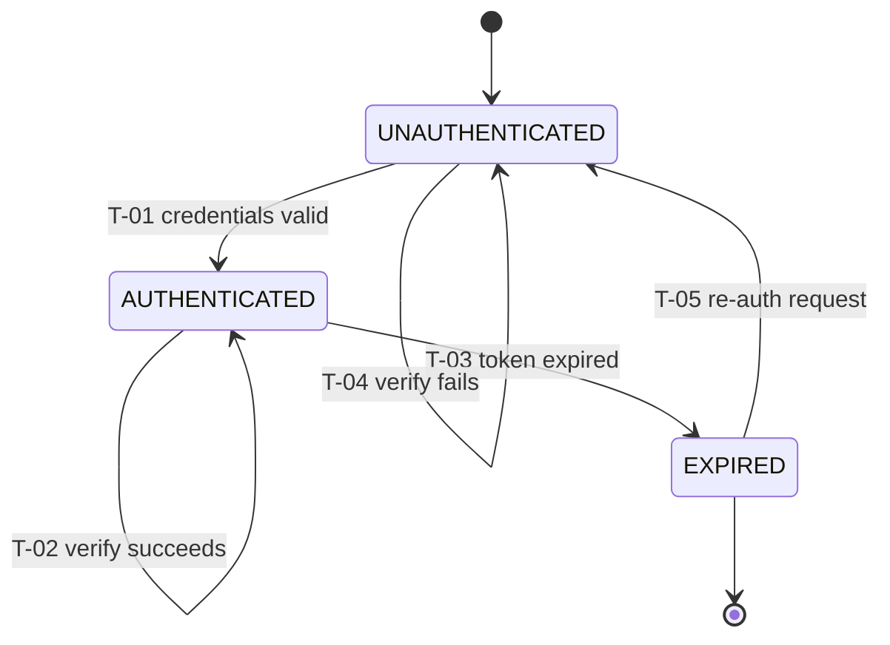

# AUTH-SM-1.0.0 — Auth State Machine Specification

| Field | Value |
|---|---|
| **Document ID** | AUTH-SM-1.0.0 |
| **Title** | Auth State Machine Specification |
| **Version** | 1.0 |
| **Status** | Frozen |
| **Governing standard** | SM-001 |
| **Derives from** | ESS-001, SM-001, TS-001 |
| **Architecture** | AUTH-ARCH-1.0.0 |
| **Owners** | CTO · Founder |
| **Planning doc** | SPD-003 |

---

## 1. Metadata header
See table above.

## 2. Purpose

Defines the **state machine** governing a session/token lifecycle. Does NOT
define the runtime execution (AUTH-RT) or public signatures (AUTH-API).

## 3. Scope

### 3.1 In scope
- Session states
- Transitions (credential check, token issue, token verify, expiry)
- Guards
- Actions/effects
- Per-state invariants

### 3.2 Out of scope (owning document)
- Runtime execution → AUTH-RT-1.0.0 (RT-001)
- Public signatures → AUTH-API-1.0.0 (API-001)
- Secret policy → AUTH-SEC-1.0.0 (SEC-001)

## 4. Definitions

| Term | Definition |
|---|---|
| Session | An identity established by a valid, unexpired JWT |

## 5. Contract

### 10. State inventory

| State ID | Name | Meaning | Type | Entry action | Exit action |
|---|---|---|---|---|---|
| S1 | UNAUTHENTICATED | No valid token; identity unknown | initial | none | — |
| S2 | AUTHENTICATED | Valid unexpired token; identity established | transient | none | — |
| S3 | EXPIRED | Token past expiry; identity no longer trusted | terminal | none | — |

### 12. Transition table

| Transition ID | From | To | Trigger | Guard | Action | Side effect |
|---|---|---|---|---|---|---|
| T-01 | UNAUTHENTICATED | AUTHENTICATED | credentials valid (`comparePassword` true) | user record exists + hash matches | caller issues token via `signToken` | session established |
| T-02 | AUTHENTICATED | AUTHENTICATED | `verifyToken` succeeds | token valid + not expired | return payload | none |
| T-03 | AUTHENTICATED | EXPIRED | token expiry reached | exp claim < now | invalidate | session ends |
| T-04 | UNAUTHENTICATED | UNAUTHENTICATED | `verifyToken` fails | token invalid/expired | throw | no session |
| T-05 | EXPIRED | UNAUTHENTICATED | caller requests re-auth | none | none | requires fresh credentials (T-01) |

### 13. Guard table

| Guard ID | Transition | Condition | Failure result |
|---|---|---|---|
| G-01 | T-01 | `comparePassword(password, hash) === true` | stays UNAUTHENTICATED; caller returns 401 |
| G-02 | T-02 | token signature valid AND not expired | T-03 or T-04 (throw) |
| G-03 | T-03 | `exp` claim < current time | none (terminal) |

### 14. Action table

| Action ID | Transition | Effect | Idempotent? | Side effect |
|---|---|---|---|---|
| A-01 | T-01 | caller signs token | yes (same creds → same identity) | CPU (bcrypt + JWT) |
| A-02 | T-02 | return decoded payload | yes | none |
| A-03 | T-03 | session invalidated | yes | none |

### 15. Invariant table

| Invariant ID | Scope | Property | Testable as |
|---|---|---|---|
| INV-S1 | global | A session is AUTHENTICATED only if `verifyToken` succeeded | verify test |
| INV-S2 | global | EXPIRED is terminal (no direct return to AUTHENTICATED without T-05 + T-01) | transition-table check |
| INV-S3 | global | UNAUTHENTICATED is the initial state | check |

### 16. Lifecycle map

### 17. Notation

Mermaid is informative; transition table (§12) is normative.

## 6. Dependencies

Upstream: AUTH-ARCH, SM-001, ESS-001.
Cross: AUTH-API symbols cite T-01..T-05; AUTH-RT executes transitions;
AUTH-SEC provides secret guard.

## 7. Domain rules

Per SM-001: one initial state (UNAUTHENTICATED); terminal marked (EXPIRED);
transitions valid; guards explicit; actions idempotent; determinism holds.

## 8. Validation

### Structural (SM-S)
| ID | Check | Pass/Fail |
|---|---|---|
| AS-S01 | State inventory present | ☐ |
| AS-S02 | Transition table present | ☐ |
| AS-S03 | Guard table present | ☐ |
| AS-S04 | Action table present | ☐ |
| AS-S05 | Invariant table present | ☐ |
| AS-S06 | Lifecycle map present | ☐ |

### Content (SM-C)
| ID | Check | Pass/Fail |
|---|---|---|
| AS-C01 | Exactly one initial state | ☐ |
| AS-C02 | Terminal states marked | ☐ |
| AS-C03 | Every transition From/To valid | ☐ |
| AS-C04 | Every guarded transition has guard row | ☐ |
| AS-C05 | Every action declares idempotency | ☐ |
| AS-C06 | Every invariant testable | ☐ |
| AS-C07 | Transition IDs unique/stable | ☐ |
| AS-C08 | Determinism | ☐ |

### Consistency (SM-X)
| ID | Check | Pass/Fail |
|---|---|---|
| AS-X01 | AUTH-RT methods cite transition IDs | ☐ |
| AS-X02 | AUTH-API symbols cite transition IDs | ☐ |
| AS-X03 | No transition leaves EXPIRED except T-05 | ☐ |

## 9. Quality gates

| Gate | Requirement | Enforced by |
|---|---|---|
| ASMG-01..06 | Structure + content (inherited) | SM reviewer |
| ASMG-07 | Invariant testability + TEST co-sign | SM reviewer + TEST owner |
| ASMG-08 | In-git freeze | CTO |

## 10. Change history

| Version | Date | Author | Change |
|---|---|---|---|
| 1.0 | (commit date) | CTO | Initial session state machine (3 states, 5 transitions). |
