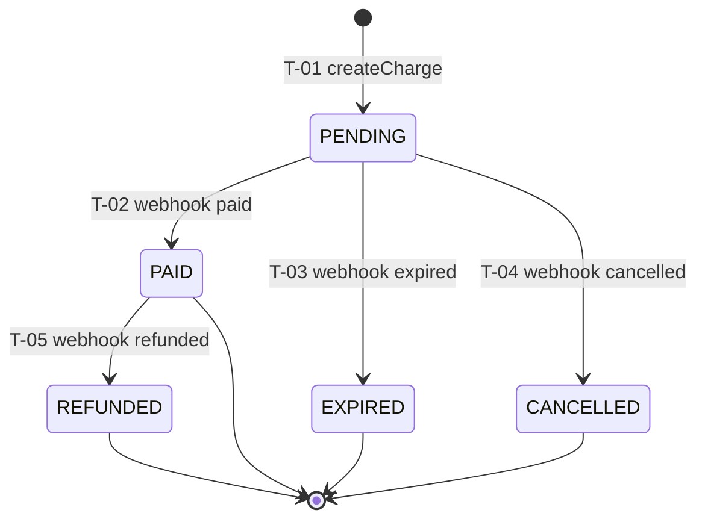

# BILL-SM-1.0.0 — Billing State Machine Specification

| Field | Value |
|---|---|
| **Document ID** | BILL-SM-1.0.0 |
| **Title** | Billing State Machine Specification |
| **Version** | 1.0 |
| **Status** | Frozen |
| **Governing standard** | SM-001 |
| **Derives from** | ESS-001, SM-001, TS-001 |
| **Architecture** | BILL-ARCH-1.0.0 |
| **Owners** | CTO · Founder |
| **Planning doc** | SPD-002 |

---

## 1. Metadata header
See table above.

## 2. Purpose

Defines the **state machine** governing a charge's lifecycle status. Does NOT
define how transitions are executed at runtime (BILL-RT) or the public
signatures that trigger them (BILL-API).

## 3. Scope

### 3.1 In scope
- Charge status states
- Transitions between statuses
- Guards on transitions
- Actions/effects of transitions
- Per-state invariants

### 3.2 Out of scope (owning document)
- Runtime execution → BILL-RT-1.0.0 (RT-001)
- Public signatures → BILL-API-1.0.0 (API-001)
- Webhook verification → BILL-SEC-1.0.0 (SEC-001)

## 4. Definitions

| Term | Definition |
|---|---|
| Charge status | The Abacatepay-provided status: PENDING, EXPIRED, CANCELLED, PAID, REFUNDED |

## 5. Contract

### 10. State inventory

| State ID | Name | Meaning | Type | Entry action | Exit action |
|---|---|---|---|---|---|
| S1 | PENDING | Charge created, awaiting payment | initial | record `createdAt` | — |
| S2 | PAID | Customer paid the charge | terminal | record `updatedAt` | — |
| S3 | EXPIRED | Charge expired unpaid | terminal | record `updatedAt` | — |
| S4 | CANCELLED | Charge cancelled | terminal | record `updatedAt` | — |
| S5 | REFUNDED | Paid charge refunded | terminal | record `updatedAt` | — |

### 11. State table — see §10 (combined; per SM-001 the state table is the
inventory above with properties).

### 12. Transition table

| Transition ID | From | To | Trigger | Guard | Action | Side effect |
|---|---|---|---|---|---|---|
| T-01 | — | PENDING | `createCharge` success | provider returns status PENDING | none | charge exists |
| T-02 | PENDING | PAID | webhook: billing paid | webhook verified (SEC-R7) | none | status=PAID |
| T-03 | PENDING | EXPIRED | webhook: billing expired | webhook verified | none | status=EXPIRED |
| T-04 | PENDING | CANCELLED | webhook: billing cancelled | webhook verified | none | status=CANCELLED |
| T-05 | PAID | REFUNDED | webhook: billing refunded | webhook verified | none | status=REFUNDED |

### 13. Guard table

| Guard ID | Transition | Condition | Failure result |
|---|---|---|---|
| G-01 | T-01 | provider returns 200 + `data.status==="PENDING"` | charge not created, error to caller |
| G-02 | T-02..T-05 | webhook verified (secret/signature) | event rejected, no transition |

### 14. Action table

| Action ID | Transition | Effect | Idempotent? | Side effect |
|---|---|---|---|---|
| A-01 | T-01 | charge record created | yes (by charge id) | provider call |
| A-02 | T-02..T-05 | status field updated | yes (by event id) | none |

All actions are idempotent (A-01 by charge id; A-02 by webhook event id, per
SEC-R8).

### 15. Invariant table

| Invariant ID | Scope | Property | Testable as |
|---|---|---|---|
| INV-S1 | global | Status is always one of the 5 enum values | type check |
| INV-S2 | global | Terminal states (PAID/EXPIRED/CANCELLED/REFUNDED) have no outgoing transitions | transition-table check |
| INV-S3 | global | A REFUNDED charge was previously PAID | audit trace |

### 16. Lifecycle map

### 17. Notation & diagrams

Mermaid `stateDiagram-v2` above is informative. The transition table (§12) is
normative; on conflict the table wins.

## 6. Dependencies

Upstream: BILL-ARCH, SM-001, ESS-001.
Cross: BILL-API symbols cite T-01..T-05; BILL-RT executes transitions; BILL-SEC
provides guard G-02.

## 7. Domain rules

Per SM-001 R1–R10: one initial state (PENDING via T-01); terminals marked;
every transition's From/To in state table; guards explicit; actions idempotent;
invariants testable; transition IDs stable; determinism holds (a given
(state, trigger) maps to exactly one transition once guards resolve).

## 8. Validation

### Structural (SM-S)
| ID | Check | Pass/Fail |
|---|---|---|
| BS-S01 | State inventory present | ☐ |
| BS-S02 | Transition table present | ☐ |
| BS-S03 | Guard table present | ☐ |
| BS-S04 | Action table present | ☐ |
| BS-S05 | Invariant table present | ☐ |
| BS-S06 | Lifecycle map present | ☐ |

### Content (SM-C)
| ID | Check | Pass/Fail |
|---|---|---|
| BS-C01 | Exactly one initial state | ☐ |
| BS-C02 | Terminal states marked | ☐ |
| BS-C03 | Every transition From/To valid | ☐ |
| BS-C04 | Every guarded transition has guard row | ☐ |
| BS-C05 | Every action declares idempotency | ☐ |
| BS-C06 | Every invariant testable | ☐ |
| BS-C07 | Transition IDs unique/stable | ☐ |
| BS-C08 | Determinism: no overlapping (state,trigger) | ☐ |

### Consistency (SM-X)
| ID | Check | Pass/Fail |
|---|---|---|
| BS-X01 | BILL-RT methods cite transition IDs | ☐ |
| BS-X02 | BILL-API symbols cite transition IDs | ☐ |
| BS-X03 | Guard G-02 consistent with BILL-SEC | ☐ |
| BS-X04 | No transition leaves a terminal state | ☐ |
| BS-X05 | Diagram consistent with tables | ☐ |

## 9. Quality gates

| Gate | Requirement | Enforced by |
|---|---|---|
| BSMG-01 | Structure conformance | SM reviewer |
| BSMG-02 | State/transition completeness | SM reviewer |
| BSMG-03 | Determinism | SM reviewer |
| BSMG-04 | Initial/terminal correctness | SM reviewer |
| BSMG-05 | Guard explicitness | SM reviewer |
| BSMG-06 | Invariant testability + TEST co-sign | SM reviewer + TEST owner |
| BSMG-07 | RT/API citation consistency | SM reviewer + RT/API owner |
| BSMG-08 | In-git freeze | CTO |

## 10. Change history

| Version | Date | Author | Change |
|---|---|---|---|
| 1.0 | (commit date) | CTO | Initial state machine for charge lifecycle (5 states, 5 transitions). |
