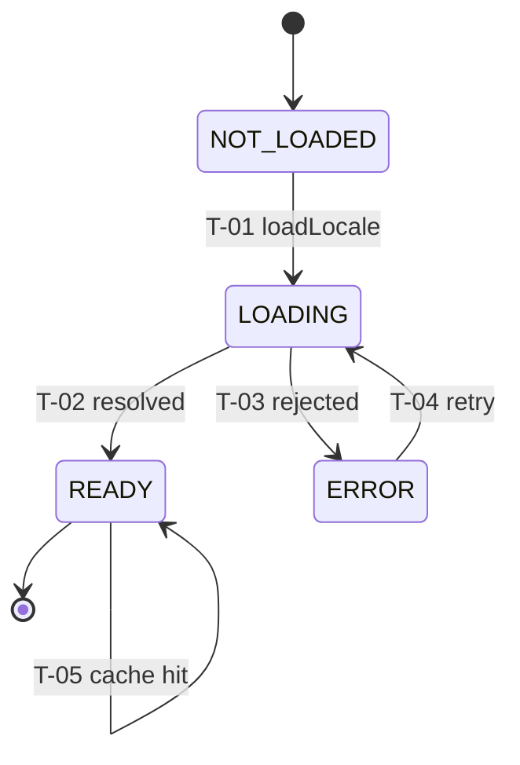

# I18N-SM-1.0.0 — i18n State Machine Specification

| Field | Value |
|---|---|
| **Document ID** | I18N-SM-1.0.0 |
| **Title** | i18n State Machine Specification |
| **Version** | 1.0 |
| **Status** | Frozen |
| **Governing standard** | SM-001 |
| **Derives from** | ESS-001, SM-001, TS-001 |
| **Architecture** | I18N-ARCH-1.0.0 |
| **Owners** | CTO · Founder |
| **Planning doc** | SPD-001 |

---

## 1. Metadata header
See table above.

## 2. Purpose

Defines the **state machine** governing a single locale's dictionary
lifecycle within an `I18nInstance`. Does NOT define runtime execution
(I18N-RT) or public signatures (I18N-API).

## 3. Scope

### 3.1 In scope
- Per-locale dictionary states
- Transitions (load, success, failure, retry)
- Guards
- Actions/effects
- Per-state invariants

### 3.2 Out of scope (owning document)
- Runtime execution → I18N-RT-1.0.0 (RT-001)
- Public signatures → I18N-API-1.0.0 (API-001)
- Security policy → I18N-SEC-1.0.0 (SEC-001)
- Active-locale switching logic → I18N-RT (setLocale); this SM is per-locale

## 4. Definitions

| Term | Definition |
|---|---|
| Locale slot | The cache entry + in-flight state for a single locale code |

## 5. Contract

### 10. State inventory

| State ID | Name | Meaning | Type | Entry action | Exit action |
|---|---|---|---|---|---|
| S1 | NOT_LOADED | Locale never requested; no cache entry | initial | none | — |
| S2 | LOADING | `loadLocale` invoked; loader promise pending | transient | store in-flight promise | — |
| S3 | READY | Dictionary loaded and cached | stable | cache dictionary | — |
| S4 | ERROR | Load failed; not cached | transient | clear in-flight | — |

### 12. Transition table

| Transition ID | From | To | Trigger | Guard | Action | Side effect |
|---|---|---|---|---|---|---|
| T-01 | NOT_LOADED | LOADING | `loadLocale(locale)` called | locale not cached, not in-flight | invoke loader; store in-flight | loader call |
| T-02 | LOADING | READY | loader resolved with object | result is a Dictionary | cache dictionary; clear in-flight | memory (cache) |
| T-03 | LOADING | ERROR | loader rejected or returned non-object | — | clear in-flight | none |
| T-04 | ERROR | LOADING | `loadLocale(locale)` called again (retry) | not cached | invoke loader; store in-flight | loader call |
| T-05 | READY | READY | `loadLocale(locale)` called (cache hit) | locale cached | return cached dictionary | none |
| T-06 | READY | READY | `setLocale(locale)` to a READY locale | locale cached | switch active locale | active locale changes |

### 13. Guard table

| Guard ID | Transition | Condition | Failure result |
|---|---|---|---|
| G-01 | T-01 | locale not in cache AND not in-flight | T-05 (cache hit) or dedup |
| G-02 | T-02 | loader result is a non-null object | T-03 (ERROR) if not |
| G-03 | T-04 | previous state is ERROR (retry allowed) | none |

### 14. Action table

| Action ID | Transition | Effect | Idempotent? | Side effect |
|---|---|---|---|---|
| A-01 | T-01 | invoke loader, store promise | no (network/IO) | loader call |
| A-02 | T-02 | cache + clear in-flight | yes (same result → same cache) | memory |
| A-03 | T-03 | clear in-flight | yes | none |
| A-04 | T-05 | return cached | yes | none |

### 15. Invariant table

| Invariant ID | Scope | Property | Testable as |
|---|---|---|---|
| INV-S1 | per-locale | A locale is READY only if its dictionary is cached | cache test |
| INV-S2 | per-locale | ERROR state has no cached dictionary | error-then-cache-miss test |
| INV-S3 | per-locale | NOT_LOADED is the initial state for every locale | check |
| INV-S4 | per-locale | LOADING has exactly one in-flight promise (dedup) | dedup test |
| INV-S5 | global | A locale in ERROR can retry (T-04) — ERROR is not terminal | retry test |

### 16. Lifecycle map

### 17. Notation

Mermaid is informative; transition table (§12) is normative.

## 6. Dependencies

Upstream: I18N-ARCH, SM-001, ESS-001.
Cross: I18N-API symbols cite T-01..T-06; I18N-RT executes transitions.

## 7. Domain rules

Per SM-001: one initial state (NOT_LOADED); ERROR is NOT terminal (retry via
T-04); READY is the stable operating state; transitions valid; guards
explicit; actions idempotent where applicable; determinism holds (same locale
+ same loader result → same cached dictionary).

## 8. Validation

### Structural (SM-S)
| ID | Check | Pass/Fail |
|---|---|---|
| IS-S01 | State inventory present | ☐ |
| IS-S02 | Transition table present | ☐ |
| IS-S03 | Guard table present | ☐ |
| IS-S04 | Action table present | ☐ |
| IS-S05 | Invariant table present | ☐ |
| IS-S06 | Lifecycle map present | ☐ |

### Content (SM-C)
| ID | Check | Pass/Fail |
|---|---|---|
| IS-C01 | Exactly one initial state | ☐ |
| IS-C02 | Terminal states marked (none terminal — ERROR retries) | ☐ |
| IS-C03 | Every transition From/To valid | ☐ |
| IS-C04 | Every guarded transition has guard row | ☐ |
| IS-C05 | Every action declares idempotency | ☐ |
| IS-C06 | Every invariant testable | ☐ |
| IS-C07 | Transition IDs unique/stable | ☐ |
| IS-C08 | Determinism | ☐ |

### Consistency (SM-X)
| ID | Check | Pass/Fail |
|---|---|---|
| IS-X01 | I18N-RT methods cite transition IDs | ☐ |
| IS-X02 | I18N-API symbols cite transition IDs | ☐ |
| IS-X03 | ERROR is retryable (T-04 exists) | ☐ |

## 9. Quality gates

| Gate | Requirement | Enforced by |
|---|---|---|
| ISMG-01..06 | Structure + content (inherited) | SM reviewer |
| ISMG-07 | Invariant testability + TEST co-sign | SM reviewer + TEST owner |
| ISMG-08 | In-git freeze | CTO |

## 10. Change history

| Version | Date | Author | Change |
|---|---|---|---|
| 1.0 | (commit date) | CTO | Initial locale-lifecycle state machine (4 states, 6 transitions; ERROR retryable). |
